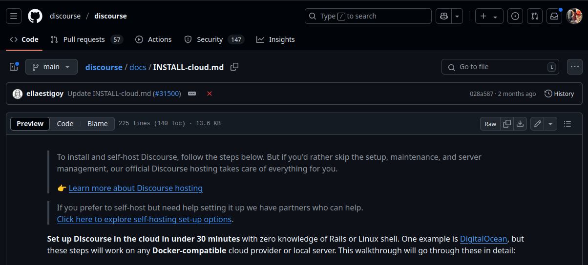
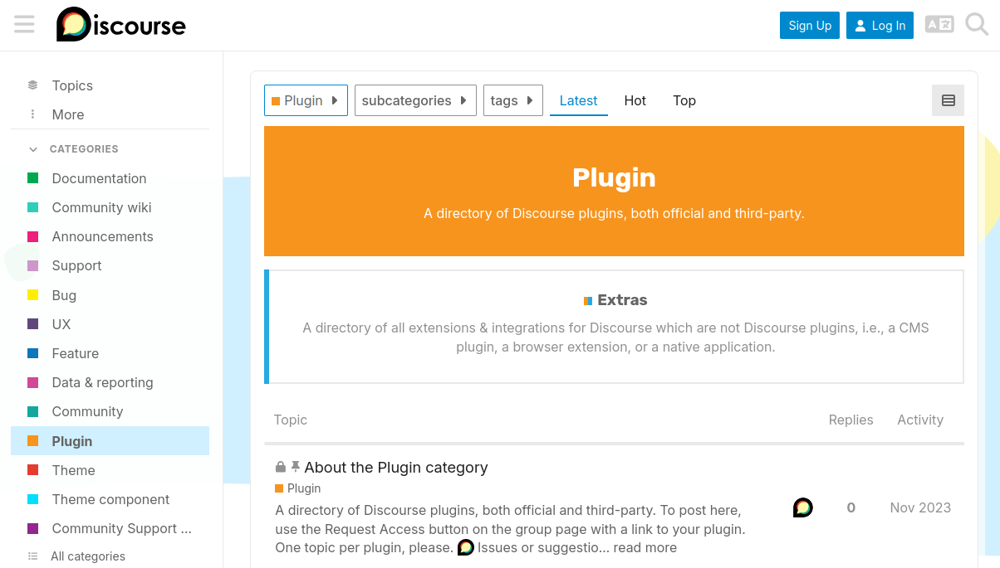
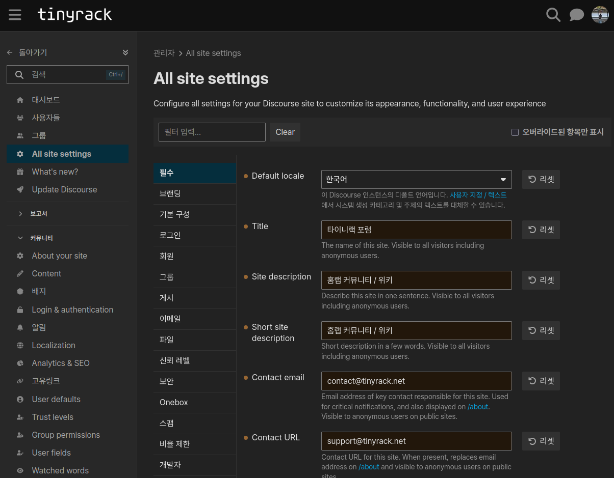
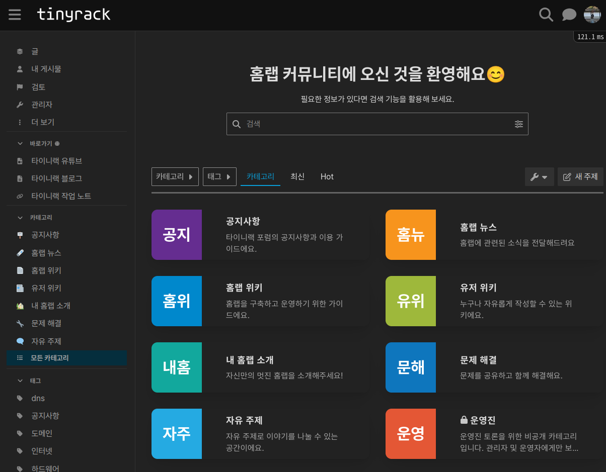

私の目標のひとつは、ホームラボが好きな人たちが集まって交流できるフォーラムを作ることでした。今回そのフォーラムがある程度完成したので、作っていった過程とあわせて紹介します。

フォーラムを作る方法は本当にさまざまですが、方法を選ぶ前に、まず自分が提供したい価値を決めるところから始めました。

- ホームラボ構築のための体系的なガイド文書
- ホームラボユーザー同士が交流できる場所
- ホームラボユーザーが互いに問題を解決できる場所

こうした目的を決めてから、フォーラムエンジンを調べ始めました。

* * *

# フォーラムエンジンを選ぶ

私はホームラボを扱っているので、当然ながら自分のサーバーでセルフホストできるフォーラムエンジンを探しました。セルフホストできるフォーラムエンジンは多く、韓国では `XpressEngine` や `Rhymix` があり、海外では `Discourse` や `NodeBB` などがあります。

いくつか見てみると、まず韓国製のフォーラムエンジンは目指している方向がかなり違うと感じました。一般的なフォーラムというより、汎用的なWebサイトビルダーに近く、フォーラムと文書作成に集中したい場合には合わないと判断しました。オープンソースのプラグインエコシステムも十分ではなく、多くの機能を自分で作る必要がありそうでした。

一方で海外のフォーラムエンジンは、本当にフォーラムのために作られた製品という印象でした。特に印象的だったのは `Discourse` です。[Discourseで作られたサイト](https://meta.discourse.org/?ref=tinyrack.net)を見て、まさに自分が求めていたものだと感じました。サイト内検索、投稿推薦、構造化された文書など、要件にぴったり合っていました。

さらに、自分がすでに知っていたり訪問したことのあるフォーラムの中にも、`Discourse` ベースのものが多いことに気づきました。多くの企業で使われていて、保守もよく行われているようだったので、これを使うことにしました。

* * *

# インストール



`Discourse` にはセルフホスト用の[公式ガイド](https://github.com/discourse/discourse/blob/main/docs/INSTALL-cloud.md?ref=tinyrack.net)があります。インストール自体はそれほど難しくありませんでしたが、惜しい点が二つありました。

一つ目は、別途メールサーバーが必要なことです。メールは少し特殊で、セルフホストが簡単ではない分野です。家庭用インターネットでは送信用ポートが塞がれていたり、動的IPだったりするため、メールサーバーとして使うのは難しいです。できればGoogleやAppleログインのような外部ログインだけを使いたかったのですが、ちょうどよい選択肢はありませんでした。

幸い、私はすでに [Hetzner Cloud](https://www.hetzner.com/?ref=tinyrack.net) のサーバーを借りて[個人用メールサーバー](https://stalw.art/?ref=tinyrack.net)を構築していたので、この問題は解決できました。それでも完全にセルフホストするのが簡単ではない点は残念でした。無料で `Discourse` をセルフホストしたいユーザーにとっては大きな壁になると思います。

二つ目は、インストールのためにDockerだけでなく独自のCLIツールを覚える必要があることです。内部ではDockerを使っていますが、完成済みのイメージを取得して使う方式ではなく、ツールを通じて動的にイメージを生成する方式です。そのため、次のようなコマンドを覚える必要がありました。

```bash
./launcher rebuild app # アプリを再ビルド
./launcher stop app # アプリを停止
./launcher start app # アプリを開始
```

通常Dockerで配布されるソフトウェアは、同じような簡単な利用体験を持つことが利点です。`docker-compose.yml` を書いて `docker compose up -d` を実行すれば使えます。しかしDiscourseではDockerと独自CLIの両方を理解する必要があり、少し不便に感じました。

とはいえ、いろいろありながらもインストール自体は無事に終わりました。その後、既存のリバースプロキシと連携し、ドメインとSSL証明書を設定して作業を完了しました。

* * *

# 設定



インストール後に少し触ってみると、機能面でいくつか惜しい点がありました。そこで[公式フォーラムのプラグインページ](https://meta.discourse.org/c/plugin/22?ref=tinyrack.net)を見ながら、いろいろインストールして試しました。最終的に選んだプラグインと理由は次のとおりです。

- Apple Auth: Appleログイン対応。GoogleやGitHubなどは標準対応
- Doc Category: サイドバーに文書の目次を表示する機能
- RSS Polling: ブログ記事を自動でDiscourseに取り込む機能
- Solved: 質問に対する「解決策」を採用できる機能
- Mermaid: エディターで [Mermaid](https://mermaid.js.org/?ref=tinyrack.net) 図の入力をサポート
- Reactions: 投稿に絵文字で反応できる機能

特に気に入ったのはブログとの連携機能です。DiscourseのEmbed機能とRSS Pollingプラグインを組み合わせると、ブログ記事を自動でDiscourseに取り込め、ブログ側には連携されたDiscourseトピックのコメントを表示できます。二つのサイトが相互に連携できるのは面白いと感じました。



プラグイン設定後は、必要なオプションを次のように変更しました。

- 名前やロゴなどのブランディング
- ランディングページ構成
- 外部ログイン設定
- 登録規約設定
- フォント変更
- ブログ連携
- 翻訳の補完

Discourseのほぼすべての設定は管理画面から変更できるので便利でした。初期設定後は、障害時以外にターミナルを使う必要はあまりなさそうです。

少し残念だったのは、海外製のエンジンなので韓国語訳が不足していたり、不自然な部分が多かったことです。それを見つけて修正する作業にかなり時間がかかりました。可能なら、いつかDiscourse本体に翻訳改善を貢献したいです。

* * *

# 完成!



これでひとまず形になりました。まだ書くべき記事は山ほどありますが、少しずつ埋めていけばもっと良いフォーラムになると思います。ここまで使ってみて感じたDiscourseの長所は次のとおりです。

- フォーラム内検索が優れています。
- SEOがよくできています。
- UI/UXの完成度が高いです。
- Markdown、HTML、Mermaidなど文書作成に役立つ機能が多いです。
- コメント埋め込みやRSSポーリングなど、外部アプリとの連携が良いです。
- サイトのバックアップと復元が簡単です。
- OAuthによる外部ログイン連携が簡単です。

良い点ばかりならよいのですが、短所もあります。

- Discourseは掲示板型ではなくスレッド型のフォーラムを志向しているため、韓国のユーザーには少し不便に感じられるかもしれません。
- 韓国語訳が不足している箇所が多いです。ただし多くのテキストは管理者が修正できます。
- エディターはMarkdown形式のみです。[WYSIWYGエディター](https://ko.wikipedia.org/wiki/%EC%9C%84%EC%A7%80%EC%9C%84%EA%B7%B8?ref=tinyrack.net)に慣れたユーザーには合わないと思います。新しいバージョンでは実験機能としてWYSIWYGエディターがありますが、まだバグが多くありました。

特にエディターの問題は残念でした。非開発者が記事を書くときの大きな壁になりそうだからです。できるだけ早くWYSIWYGエディターが正式機能になることを期待しています。

* * *

# おわりに

フォーラムは、私の夢であるホームラボユニバース、つまりWiki、コミュニティ、ニュース、レビューの中で、Wikiとコミュニティの役割を担う予定です。作ったフォーラムが気になる方は、[このリンク](https://forum.tinyrack.net/?ref=tinyrack.net)や上部メニューのForumボタンから訪問してみてください。
