> この製品はメーカーから無償で貸与されたものです。<br>
> 本レビューはメーカーのガイドラインなしに、率直に作成しています。

以前YouTubeに [Sipeed NanoKVM](https://youtu.be/xJJvupLO9uM?si=ZdVAuVIvlGXQTKVr&ref=tinyrack.net) というKVM製品のレビュー動画を投稿したところ、しばらくして一通のメールが届きました。

> I hope this message finds you well. My name is Billy Wang, founder of TecxArtisan and product manager of Openterface. I’m reaching out to introduce our latest Open-source gadget, the [Openterface Mini-KVM](https://openterface.com/?ref=tinyrack.net), a KVM-over-USB gadget we’ve been developing for the past year. We’d love the opportunity to **send you an Openterface Mini-KVM Toolkit for your review**. We are keen on exploring the opportunity that you can support our open-source development by introducing this handy KVM-over-USB gadget to a wider audience.

TecxArtisanという会社がOpenterfaceというオープンソースUSB KVMを作っており、レビューしてみないかという内容でした。広告料を受け取るわけでもなく、レビューのガイドラインが決まっているわけでもなかったので、快く引き受けました。

* * *

# パッケージと外観

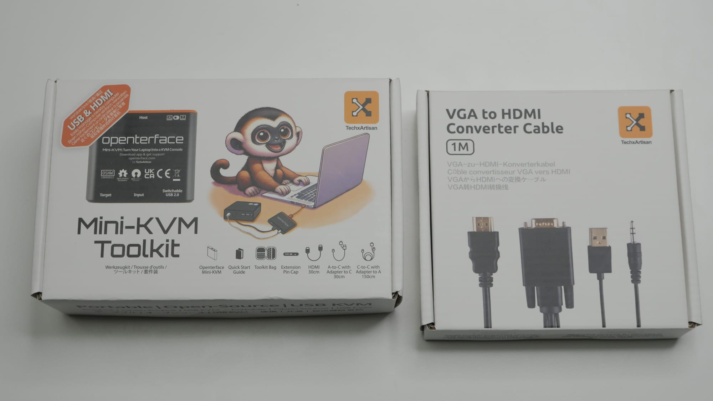

届いたパッケージは上の写真のような構成です。Openterface本体とケーブルが入ったメインキット、そして別売りのVGA to HDMIコンバーターキットに分かれていました。コンバーターキットはHDMIポートがない古い機器で役立ちますが、私はそうした機器を持っていないので、今回はメインキットだけを使いました。

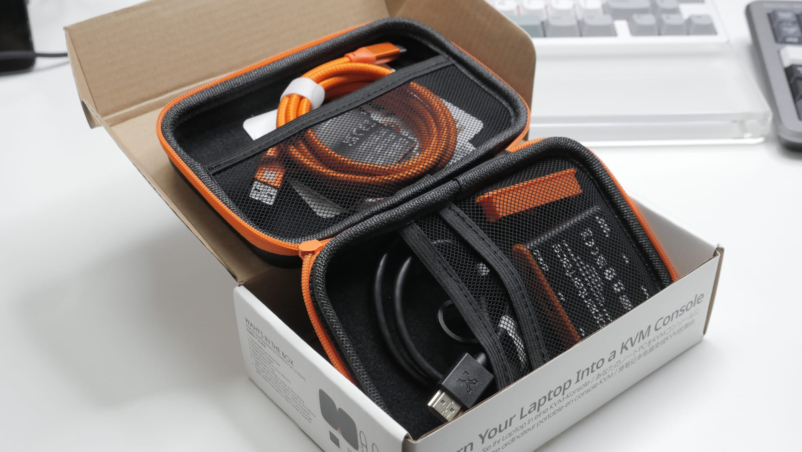

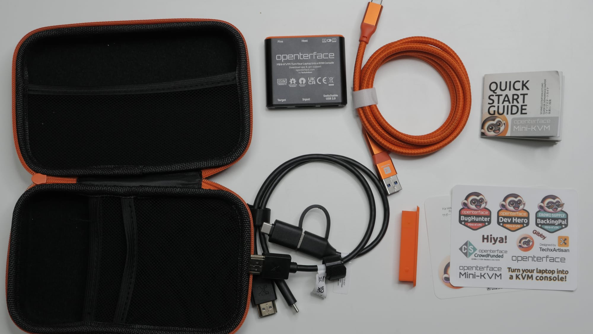

Openterface本体キットの構成は次のとおりです。

- バッグ
- 製品本体
- Openterfaceとホスト接続用のUSBケーブル
- Openterfaceとターゲット接続用のUSBケーブル
- Openterfaceとターゲット接続用のHDMIケーブル
- その他
  - 本体の拡張ピンを制御できる交換用キャップ
  - クイックスタートガイド
  - 各種ステッカー

USB方式のKVMは性質上ケーブルが多くなりますが、ひとつのバッグで整理して持ち運べるようにした点は気に入りました。

ホスト接続用ケーブルは20Gbpsの高帯域ケーブルが同梱されています。そこまでの帯域は必要なさそうなので少し不思議でしたが、あるに越したことはありません。

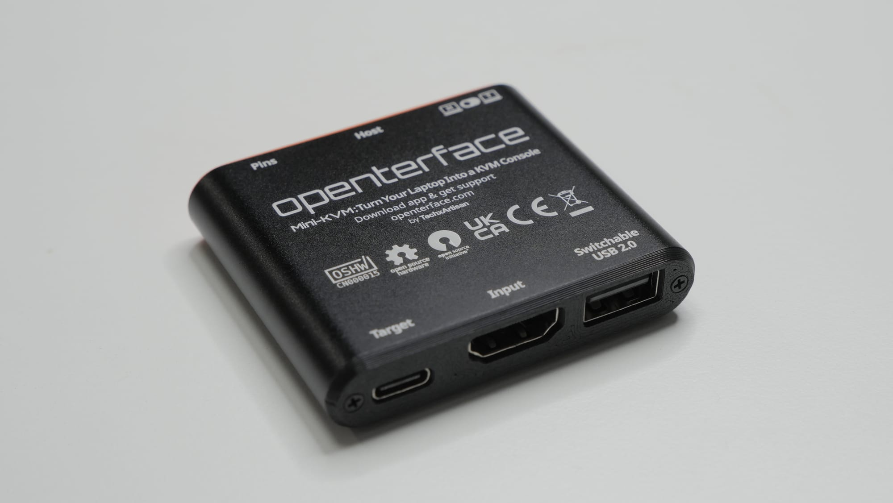

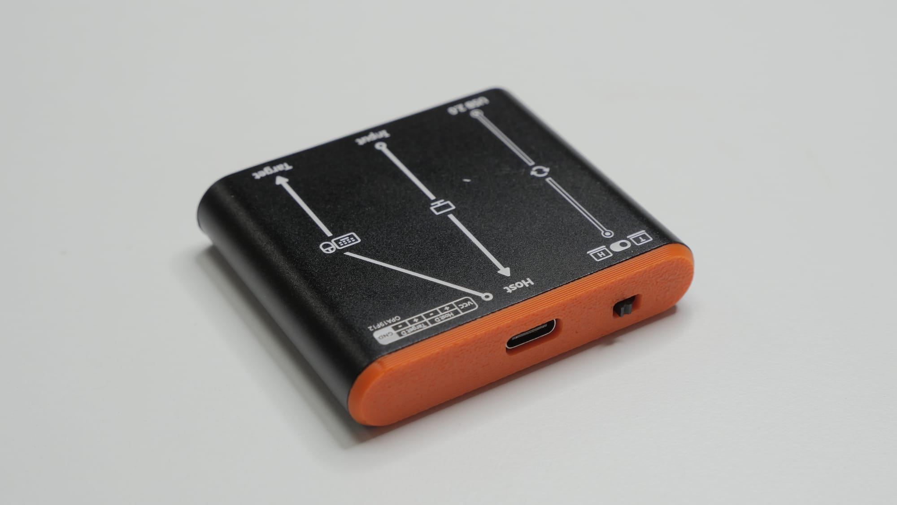

Openterface本体は金属製で、各種認証マークと図が入っています。上下のオレンジ色のケーブルガイドは3Dプリント部品に見えますが、かなりきれいに出力されていて不満はありませんでした。特別に美しいデザインではありませんが、用途を考えると十分適切だと思います。

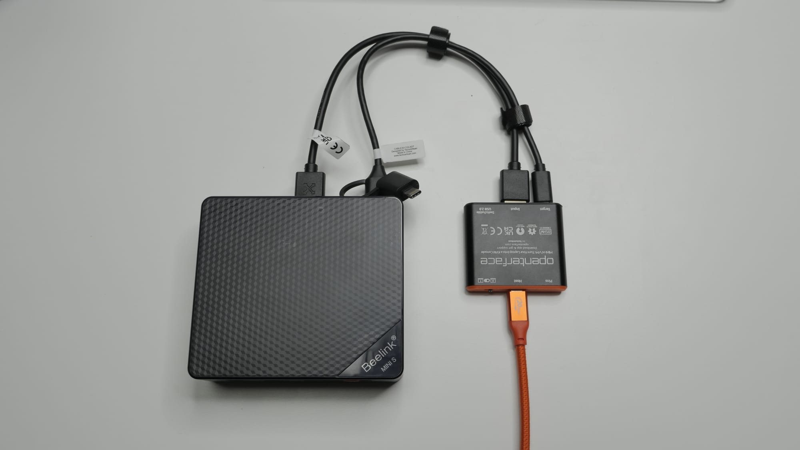

使用時に接続するとこのような状態になります。USBはType-CとType-Aの両方で使えるよう変換アダプターが用意されています。

* * *

# 価格

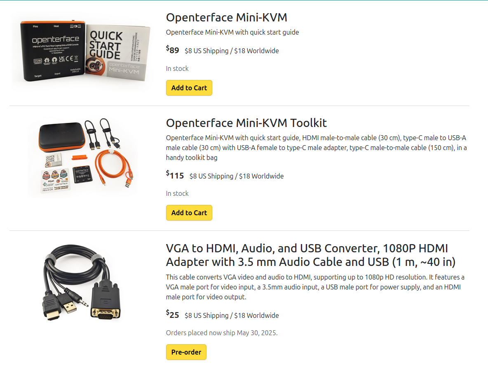

Openterfaceは現在クラウドファンディング方式で販売されています。個人的にはあまり好きな方式ではありません。クラウドファンディングの弱点は多くの人が知っているように、製品がきちんと完成しなかったり、配送が何度も遅れたりすることがある点です。

幸い、Openterfaceは現時点では実物を生産し、購入者に届けているようです。それでも、今後はAmazonやAliExpressのような一般的な販売経路へ移行したほうが、消費者保護の面で良いと思います。

現在Openterfaceは三つの構成で販売されています。

- 本体のみ: $89
- バッグとケーブル入りキット: $115
- VGA to HDMIコンバーターキット: $25

本体単品とキットの価格差は大きくないので、私ならキットを購入すると思います。ただし全体的にはかなり高いと感じます。小規模メーカーで需要も多くない分野なのでコストパフォーマンスを出しにくいのは理解できますが、それでも高めです。

競合といえる [NanoKVM USB](https://wiki.sipeed.com/hardware/en/kvm/NanoKVM_USB/introduction.html?ref=tinyrack.net) は、似たようなキット構成で韓国ウォン約77,000ウォン程度で発売されました。それと比べると約2倍の差があるため、明確な機能的優位がなければ選びにくいと感じました。

* * *

# オープンソース

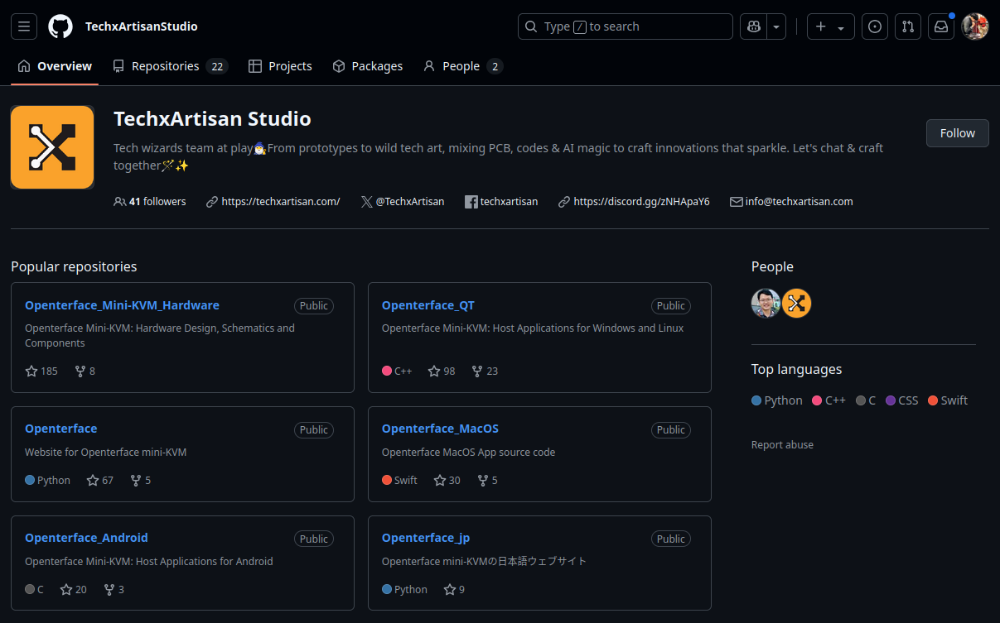

Openterfaceは完全なオープンソースハードウェアとソフトウェアを目指しています。誰でも製品改善に貢献でき、設計図を使って自分だけの製品を作ることもできます。すべてのソースは [GitHub](https://github.com/TechxArtisanStudio?ref=tinyrack.net) で公開されています。

この方式には、メーカーが廃業してもコミュニティがハードウェアとソフトウェアのサポートを続けられること、製品のセキュリティが透明に公開されるためユーザーが信頼しやすいことなどの利点があります。

一方で、他社がクローン製品を作った場合、メーカーが対応しにくくなります。だから通常、オープンソースという決定は簡単にはできません。同じくオープンソースハードウェアを掲げたNanoKVMでさえ、製品の認知度が上がってからソースを公開しました。

こう見ると、オープンソースはメーカーの天使のような行動に思えるかもしれませんが、実際にはそうでない場合もあります。完成度の低いソフトウェアを公開し、消費者が自分で直して使うことを期待しているように感じるケースもあります。

まだOpenterfaceのソフトウェアを深く使う前ですが、開発活動は活発に見えます。この種の製品ではソフトウェアサポートが重要なので、今後も積極的に開発が続くことを期待しています。

* * *

# ソフトウェア

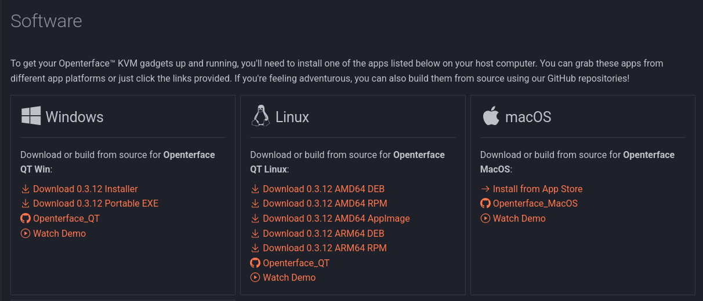

それでは実際に使ってみます。OpenterfaceのソフトウェアはmacOS、Windows、Linux向けに提供されています。私のMacはこのOpenterfaceで修理したい状況なので、今回はWindowsとLinuxでの使用経験だけを話します。

## Windows

Windows版にはポータブル版とインストーラー版があります。私はインストーラー版を使いました。

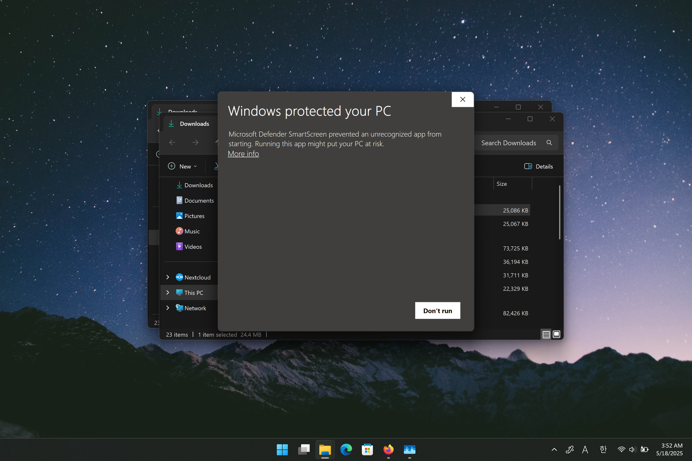

まず残念だったのは、インストーラーに適切な証明書がなく、SmartScreenの警告が表示されたことです。最近は証明書があっても評判が積み上がるまでは警告が出ることがありますが、少なくとも証明書は発行してインストーラーに適用すべきだと思います。

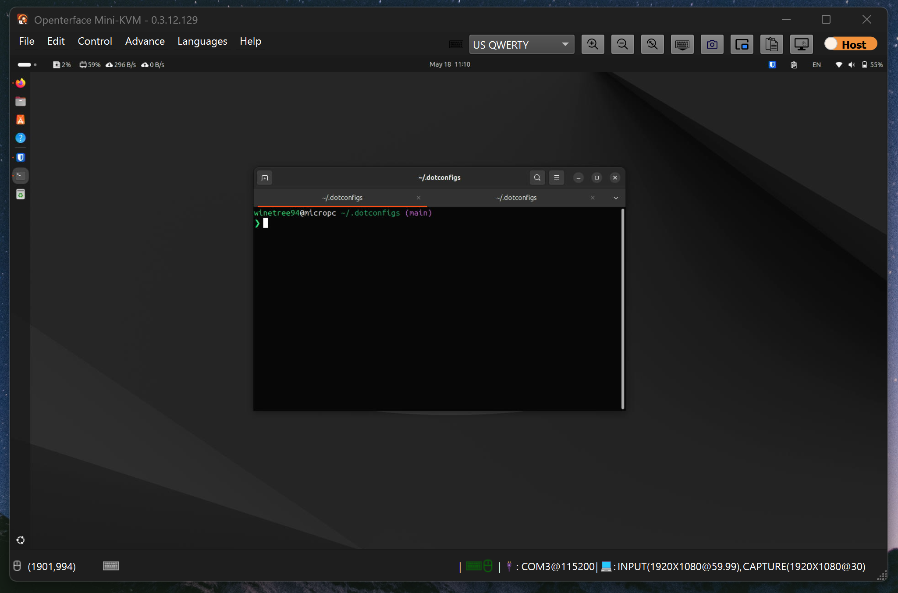

インストール後の初回起動ではドライバーのインストールが行われ、再起動して再度実行すると特別な手順なしに動作しました。FHD解像度の画面を表示し、キーボードとマウス操作をすぐに送ることができ、BIOSに入って操作することも問題ありませんでした。

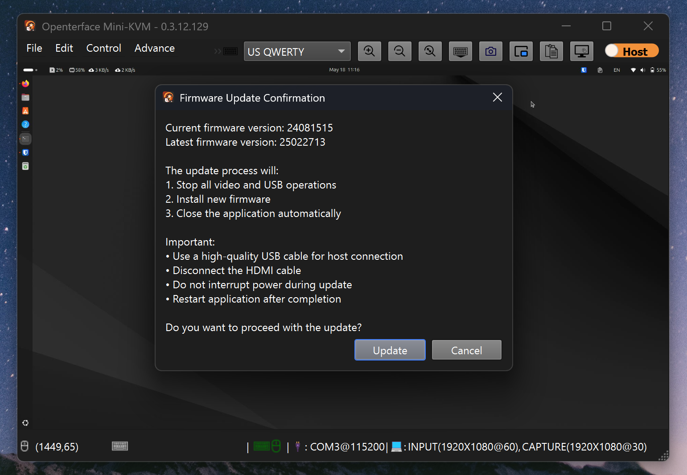

設定には本体のファームウェア更新機能もあり、こちらも正常に動作しました。

少し変わっていたのは `Mouse Dance` という機能です。これはマウスをランダムに動かしてくれる機能です。在宅勤務時に会社のアイドル検知を回避したり、スリープを防いだりする目的で使われることがあり、面白い機能だと思いました。

## 使用感

まずKVMに期待することを言うと、私はKVMに低遅延や高画質を求めていません。KVMはシステムの問題時に使う緊急用ソリューションだと考えているので、最も重要なのは接続の安定性です。

もしゲームやリモートデスクトップが目的なら、KVMは合わない可能性が高いです。その場合はParsecやRDPのようなソフトウェアベースのソリューションのほうが性能は良いでしょう。

私がOpenterfaceに期待したのは、どのように接続してもまず正しく動作するかという点です。そこで次の状況をテストしました。

- 途中でホストケーブルを再接続: 動作
- ターゲットのマウス/キーボードUSBケーブルを再接続: 動作
- ターゲットのディスプレイケーブルを再接続: 動作
- ターゲット側のケーブルだけを挿した状態でホスト接続: 動作
- ホストだけ接続した状態でターゲット側ケーブルを接続: 動作
- 電源オフ状態で接続して起動したときにBIOSへ入る: 動作
- 電源オン状態で接続して再起動したときにBIOSへ入る: 動作

当然の機能だと思うかもしれませんが、実はこれがうまくいかない製品もあります。KVMは複数のケーブルを複雑に接続する必要があるため、特定の順番で接続しないと動かない製品はとても面倒です。

Openterfaceは私のテストではすべて正常に動作しました。少なくともWindowsでは、きちんとしたソフトウェアを提供していると思います。

## Linux対応

次にLinux対応を見ました。私はメインOSがLinux、具体的にはUbuntu 24.04なので、Linuxで動作するかどうかが最も重要でした。まず[公式サイト](https://openterface.com/app/?ref=tinyrack.net)から入手したパッケージをインストールし、[GitHub](https://github.com/TechxArtisanStudio/Openterface_QT?ref=tinyrack.net)のインストールガイドに従いました。ガイドではインストールに加えて、次のコマンドで依存関係と権限を設定するよう案内されています。

```bash
# Setup the QT 6.4.2 or laterruntime and other dependencies
sudo apt install -y \
   libqt6core6 \
   libqt6dbus6 \
   libqt6gui6 \
   libqt6network6 \
   libqt6multimedia6 \
   libqt6multimediawidgets6 \
   libqt6serialport6 \
   libqt6svg6 \
   libusb-1.0-0-dev

# Setup the dialout permission for Serial port
sudo usermod -a -G dialout $USER

# Setup the hidraw permission
echo 'SUBSYSTEM=="usb", ATTRS{idVendor}=="534d", ATTRS{idProduct}=="2109", TAG+="uaccess"' | sudo tee /etc/udev/rules.d/51-openterface.rules
sudo udevadm control --reload-rules
sudo udevadm trigger
```

まず残念だったのは、パッケージをインストールするだけでなく、システムにさまざまな変更を加える必要がある点です。私はソフトウェアがインストール後すぐに実行できるくらい簡単であってほしいと思っていました。

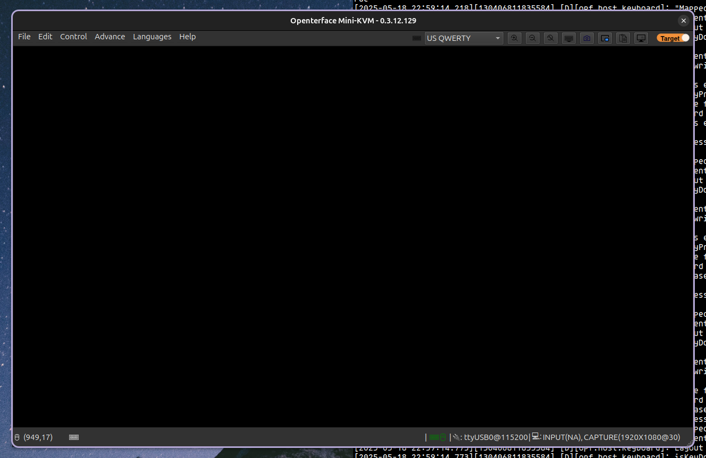

しかし、いろいろ試した結果、結局LinuxでOpenterfaceを使うことは諦めました。短時間つながることもありましたが、多くの状況で実用が難しい問題が発生しました。

- 説明どおり進めてもSerial関連の権限エラーが発生し、root権限で実行する必要がある
- オプションを変えても画面出力ができない
- ファームウェア更新機能が動作しない
- 使用中にアプリがクラッシュする

現時点では、Linux対応が十分にできているとは言いにくいです。この部分はさらに多くの改善が必要だと思います。

* * *

# まとめ

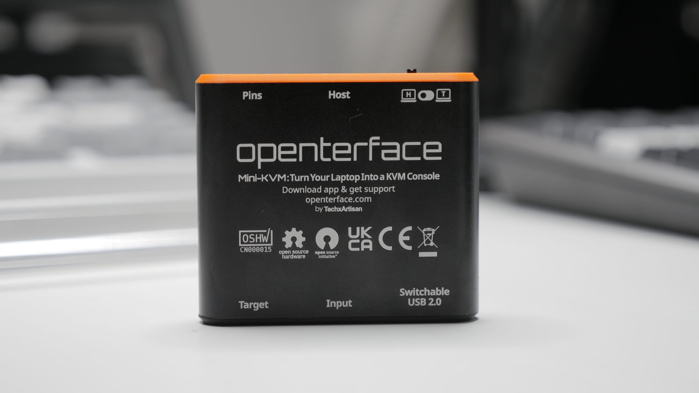

ここまで見た限り、OpenterfaceはKVMとしての価値を十分に備えていると思います。私のテストでは接続の安定性も十分で、少なくともWindowsではきちんとしたソフトウェアを提供していました。macOSでもうまく動くなら、主要なホストOSでは大きな問題なく使えると期待できます。

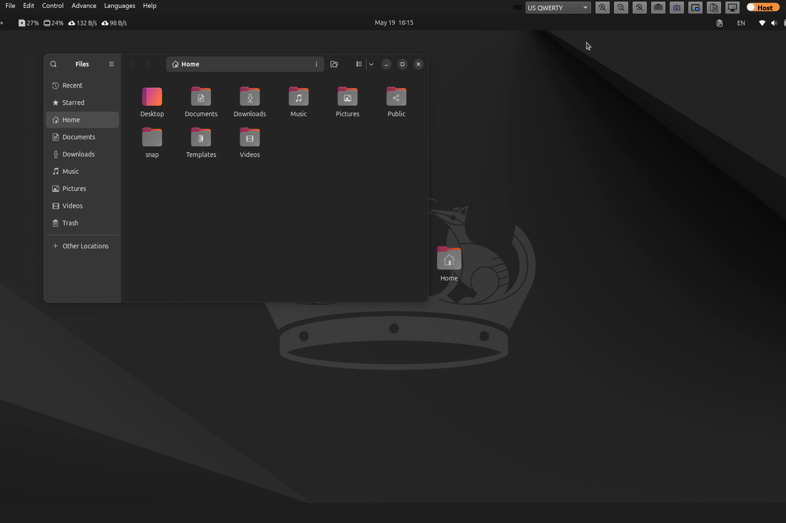

ただし改善点も多くありました。全画面で画面が切れるなど細かなバグがあり、Linuxソフトウェアは通常利用が難しい状態でした。今後改善されるとは思いますが、消費者が製品を受け取る前に解決されているほうが良かったと思います。

最大の問題は価格です。新興企業なので完成度が不足することは理解できますが、NanoKVMのような完成度の高い製品と比べたとき、明確な優位を見つけるのは難しかったです。オープンソースに近いという利点だけでは足りないと感じました。

全体としては満足より惜しさのほうが強い製品でしたが、それでもこうした挑戦をする企業があるのは本当にうれしいことです。安価なサーバー機器を作る企業は多くありません。今後さらに発展して、面白い製品をたくさん見せてくれることを期待しています。
