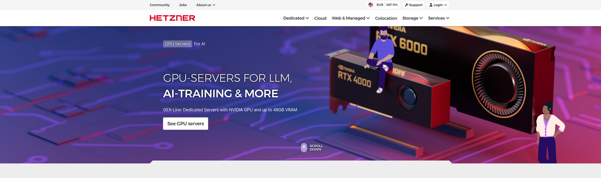
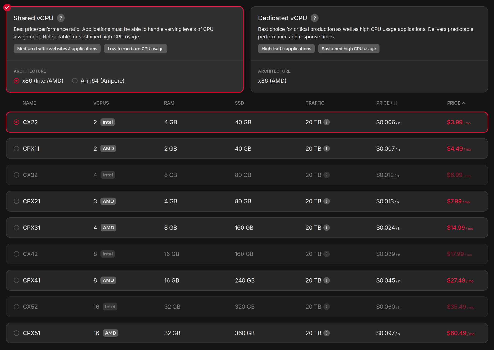
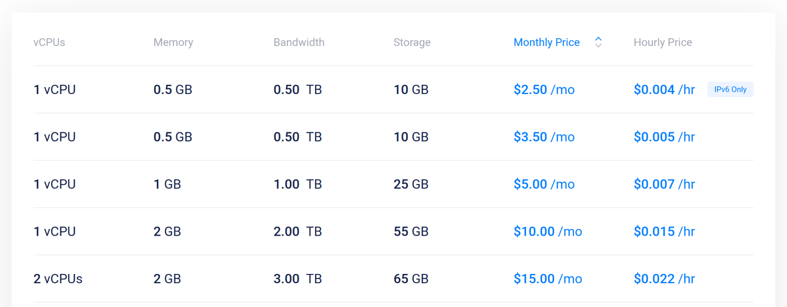
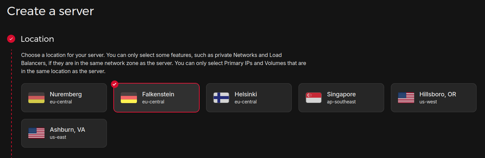
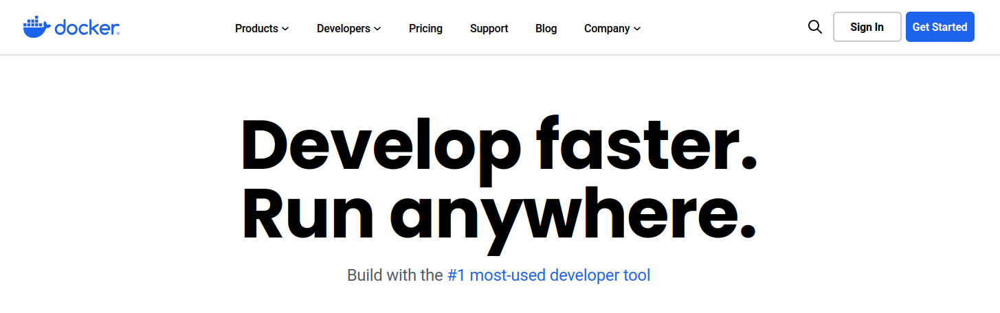
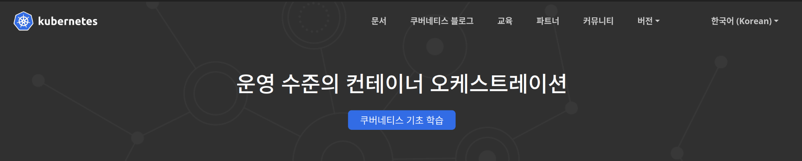
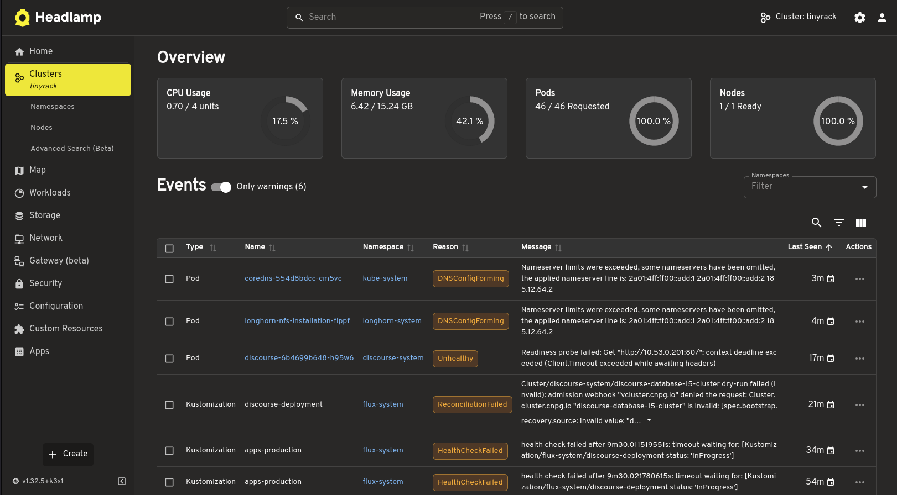
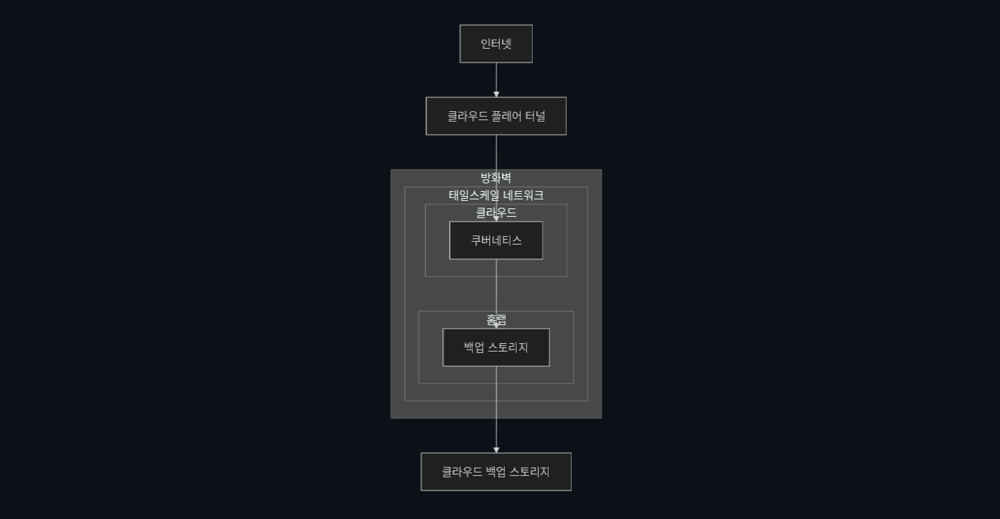

원래 타이니랙의 모든 서비스는 제 집에서 직접 운영해왔어요. 아직은 초창기이고 트래픽도 많지 않다보니 충분히 감당 가능할 것이라 예상했었거든요.

그런데 제가 이사를 해야하는 상황이 발생했어요. 이는 곧 서비스의 중단을 의미하다 보니 걱정이 밀려오기 시작했는데요. 이런 저런 고민을 하다가 결국은 나 혼자 쓰는 용도 외의 서버만큼은 사용자를 위해서라도 외부 클라우드에서 안정적으로 운영하는게 좋겠다는 결론을 내리게 됐어요.

그래서 최종적으로는 헤츠너(Hetzner) 클라우드의 가상 머신을 임대해서 쿠버네티스로 인프라를 새롭게 구축하게 됐는데요. 그래서 이 과정을 한번 소개해드리고자 해요.

* * *

# 클라우드 서비스 선정

가장 먼저 한 고민은 어느 클라우드 서비스를 사용할 것인가에요. 개발자 분들이라면 아마 아마존(AWS), 애저(Azure), 구글 클라우드 플랫폼(GCP) 같은 메이저 클라우드 업체를 사용하실텐데, 저는 아직까진 서비스의 수익화를 고려하지 않았기 때문에 이런 대형 클라우드는 금전적으로 부담이 컸어요. 이들은 시작은 무료로 할 수 있을지라도 서비스 성장에 따라 지출 비용이 가파르게 상승하는 구조거든요.

그래서 이런 저런 서비스를 찾아보다가 최종적으로 결정한 서비스는 독일 업체인 헤츠너(Hetzner)에요. 이 업체는 매우 저렴한 서버 임대 비용과 혜자스러운 사용량 정책이라는 아주 큰 장점을 가지고 있었어요.

헤츠너에서 가장 저렴한 공유 서버는 4달러 정도에 임대할 수 있었는데 컴퓨팅 자원과 트래픽 제한도 타사 대비 압도적이었어요.

이건 [Vurtr](https://www.vultr.com/pricing/?ref=tinyrack.net) 이라는 업체의 공유 서버 임대 가격표에요. 최저가는 좀 더 낮기는 하지만 자원 할당량을 보면 헤츠너가 엄청나게 저렴한 편이라는 걸 알 수 있어요.

이렇게 저렴하면 보통 두가지가 걱정되는데, **서비스 안정성과 연결 속도**에요. 먼저 서비스 안정성의 경우 여러 커뮤니티를 돌며 평가를 보니 큰 문제가 없다는 의견이 많았어요. 저는 이미 헤츠너에서 메일 서버를 안정적으로 운영중이였기 때문에 이 부분은 큰 걱정이 되지 않았어요.

다음 연결 속도의 경우는 서버가 유럽에 있다 보니 크게 걱정됐던 부분이에요. 웹 페이지 로딩이 오래걸리면 사용자의 이탈률이 높아질 수 있거든요.

그래서 우선은 헤츠너에서 제공하는 서버의 지역 중에서 국내에서 가장 빠르게 접근 가능한 서버를 알아봤어요. 커뮤니티를 탐방하다 보니 [헤츠너 레이턴시 테스트](https://hetzner-latency.sliplane.io/?ref=tinyrack.net)라는 페이지를 찾을 수 있었는데, 한국에서는 팔켄슈테인 지역의 서버를 임대하는 것이 가장 유리해 보였어요. 미국이나 싱가폴 서버의 속도가 가장 빠르긴 했지만 이들은 트래픽 비용이 높아서 선택에서 제외하게 됐어요.

그리고 저는 [**클라우드플레어  프록시**](https://www.cloudflare.com/ko-kr/learning/cdn/glossary/reverse-proxy/?ref=tinyrack.net)를 사용할 계획이였기 때문에 서버와의 거리가 멀더라도 어느 정도 속도 향상의 효과를 누릴 수 있을 것이라 기대했어요. 그래서 테스트 서버를 구축해서 렌더링 속도를 확인해보니 이 정도면 충분히 만족스럽다고 판단하게 됐어요.

지금 보시는 페이지나 제 [포럼](https://forum.tinyrack.net/?ref=tinyrack.net)의 속도가 답답하게 느껴지시지 않는다면 제 선택이 옳았던 것일 거예요 😄

제가 최종적으로 구성한 서버와 가격은 다음과 같아요.

- 가상 서버 종류: Dedicated vCPU
- CPU: 4코어
- 램: 16GB
- 스토리지: 160GB
- 무료 트래픽: 20TB
- 운영체제: 우분투 24.04
- 가격: 월 26.49$

지금은 요구 사항 대비 조금 높은 사양으로 잡아놨는데, 헤츠너는 스토리지 용량이 같은 다른 사양이라면 다운그레이드도 지원해요. 그래서 추후 필요에 따라 조정하려 해요.

* * *

# 서비스 구축

## 도커의 한계

서버는 준비됐으니 이제 소프트웨어를 설정할 차례에요. 이전에는 도커 환경으로만 서비스를 구축했었는데요. 이 경우 두가지 문제가 있었는데 **수평적 확장성과 재해 복구성이 낮다**는 점이에요.

**수평적 확장성**이란 한 서버로 감당할 수 없을 만큼 서비스 사용자가 많아졌을 때 이를 쉽게 여러 서버 컴퓨터로 분산해 처리할 수 있는지를 의미해요. 도커는 단일 머신에서 컨테이너 관리를 위한 소프트웨어이기 때문에 이 용도에는 적합하지 않았어요.

**재해 복구성**이란 서버가 고장나거나 인프라를 이전해야 하는 상황이 발생했을 때, 신속히 서버 구성과 데이터를 복원할 수 있는가에요. 도커는 별도의 자체 백업 솔루션이 없어서 서비스마다 일일히 백업과 복구를 구성해야 했기 때문에 많은 불편함이 있었어요.

## 쿠버네티스의 도입

그래서 이번에는 도커가 아닌 쿠버네티스를 활용해 보기로 마음을 먹게 됐어요. 쿠버네티스는 분산 컴퓨터 환경(클러스터)에서의 컨테이너 관리를 자동으로 해주는 소프트웨어인데 그래서 컨테이너 오케스트레이션 소프트웨어라고 불려요. 이를 통해 수평적 확장성을 쉽게 달성할 수 있게 돼요.

또한 쿠버네티스는 인프라의 백업과 복구를 위한 도구들이 많이 발전해 있어서 재해 복구성을 쉽게 달성할 수 있게 돼요. 덕분에 헤츠너가 마음에 들지 않거나 고장난다면 언제든 인프라를 쉽게 이전할 수 있다는 장점도 가질 수 있게 됐어요.

하지만 장점만 있는건 아니였어요. 일단 가장 큰 문제는 쿠버네티스의 **학습 곡선이 높아서** 이를 제대로 활용할 수 있을 정도로 배우기까지가 상당히 고된 일이었어요. 그래서 가상 머신으로 클러스터를 생성하고 삭제하기를 수없이 반복하면서 익숙해지는데 많은 시간을 투자했어요.

두번째는 **쿠버네티스에 적용하기 까다로운 소프트웨어도 있다는 점**이에요. 대표적으로는 제가 운영하는 포럼 엔진인 Discourse 였는데, 이를 쿠버네티스에 적용할 방법을 찾느라 많은 삽질이 필요했어요. 결국은 [별도의 프로젝트를 구축](https://github.com/tinyrack-net/discourse?ref=tinyrack.net)해서 문제를 해결했지만 관리 포인트가 늘어난 느낌이라 언젠가 다시 한번 개선할 필요가 있다고 생각해요.

Headlamp Kubernetes Dashboard

## 오픈 소스

이후 많은 삽질과 인고의 시간 끝에 쿠버네티스 인프라를 완성하게 됐어요. 이후엔 도커 기반의 기존 서비스의 데이터를 쿠버네티스로 복원하는 작업을 진행했고, 마지막으로 쿠버네티스로 도메인을 연결해 이전 작업을 완료했어요.

그리고 이 과정을 다른 분들도 참고하실 수 있도록 오픈 소스로 남겨보면 좋겠다고 생각해서 [Github 프로젝트](https://github.com/tinyrack-net/infrastructure?ref=tinyrack.net)를 공개했어요. 제 작업이 궁금하시거나 쿠버네티스로 홈랩을 구축하고 싶으시다면 참고해 보시길 바래요.

* * *

# 보안 전략

최근에 이런 저런 서버 해킹 사건이 자주 발생하고 있어요. 그래서 서버를 다시 구축하는 과정에서 보안성을 점검하고 개선하는 작업도 진행했는데요.

이번에는 **제로 트러스트** 보안 전략을 적용했어요. 이는 기본적으로 모든 네트워크 접근을 의심하고 점검하겠다는 것을 의미하는데요. 그래서 서버의 공인 IP를 통한 모든 네트워크 접근을 방화벽에서 차단하고 외부에서는 오직 [클라우드플레어 터널](https://blog.cloudflare.com/ko-kr/tag/cloudflare-tunnel/?ref=tinyrack.net)을 통해서만 서비스로 접근할 수 있게 구성했어요. 서버의 관리도 [테일스케일](https://tailscale.com/?ref=tinyrack.net)을 통한 가상 사설망에서의 접근만을 허용해요.

이는 공인 IP의 노출을 최대한 막고, 노출되더라도 모든 네트워크 요청을 차단해 방어하겠다는 전략이에요. 보안에 완벽한 방법은 없다지만 이 정도면 네트워크 레벨에서의 공격은 충분히 방어할 수 있을 것이라 기대해요.

* * *

# 데이터 보호

저와 같이 셀프 호스팅으로 무언가를 구축한다면 가장 걱정되는 지점은 데이터를 어떻게 보호할 것인가일 거예요.

값비싼 관리형 클라우드의 경우 보통 데이터베이스와 스토리지 백업을 알아서 해주기 때문에 크게 신경쓸 지점이 없어요. 하지만 저처럼 서비스의 데이터를 직접 관리하는 분들이라면 데이터를 어떻게 백업하고 복원할 것인가를 늘 신경써야만 해요.

그래서 저는 [3-2-1 백업 전략](https://experience.dropbox.com/ko-kr/resources/3-2-1-backup-strategy?ref=tinyrack.net)을 적용했는데 이는 다음의 의미를 가져요.

- 원본 데이터 외 최소 2개의 데이터 백업 저장
- 하나의 백업은 물리적으로 다른 장치에 저장
- 하나의 백업은 물리적으로 다른 지역에 저장

저는 이를 달성하기 위해 서비스의 모든 데이터는 일정 주기마다 제 홈랩 스토리지 서버에 백업되도록 구성하고, 이는 다시 해외의 스토리지 서버로 백업되도록 구성했어요.

이렇게 되면 서버에 문제가 생겼을 때, 독일과 한국의 백업본 중 하나라도 존재하면 서비스를 정상적으로 복원할 수 있게 돼요. 이 정도면 충분히 안전할 수 있겠죠?

* * *

# 다음 스텝

원래 클라우드로 이전만 시키려 했던 작업이 생각보다 많이 커지게 됐어요. 그래도 새로운 기술을 즐겁게 배우며 더 안전한 서버를 구축할 수 있게 되었고, 앞으로 쿠버네티스를 활용해서 제 홈랩도 개선하고 싶은 의욕까지 생기게 됐어요.

아직 제 인프라는 개선할 것들이 많아요. Discourse 의 배포 방식도 개선해야 하고, 현재 쿠버네티스 구성은 단일 머신을 기준으로 구성했기 때문에 추후 수평적 확장이 가능한 구조로 변경이 필요해요.

하지만 지금 규모에서는 충분히 트래픽을 감당할 수 있으니 우선은 컨텐츠 제작 작업에 좀 더 집중하려 해요. 제 인프라에 큰 변화가 생긴다면 그 때 다시 소개해 드려볼게요. 그럼 다음에 만나요!
